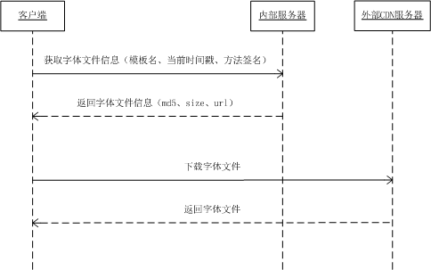
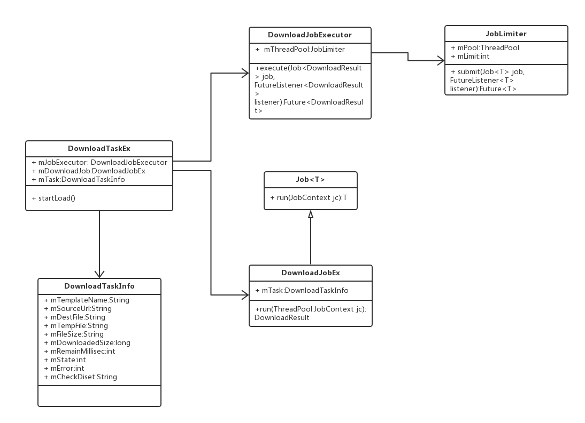

# 目前便签的主题由两部分组成：UI（背景、间距、字体大小/颜色/对齐方式/行距、工具条颜色等）和字体
## 1. 抽象主题的UI属性，定义成style（res/values/attrs.xml、res/values/template.xml）  
	//@attrs.xml
	<declare-styleable name="template">
        <attr name="statusbar_color">
            <enum name="white" value="1" />
            <enum name="black" value="0" />
        </attr>
        <attr name="window_background" format="color|reference" />
        <attr name="actionbar_color" format="color|reference" />
        <attr name="tag_color" format="color|reference" />
        <attr name="remind_color" format="color|reference" />
        <attr name="floatbar_color" format="color|reference" />
        <attr name="content_background" format="color|reference" />
        <attr name="content_paddingLeft" format="dimension" />
        <attr name="content_paddingRight" format="dimension" />
        <attr name="content_paddingTop" format="dimension" />
        <attr name="content_paddingBottom" format="dimension" />
        <attr name="text_paddingLeft" format="dimension" />
        <attr name="text_paddingRight" format="dimension" />
        <attr name="record_paddingLeft" format="dimension" />
        <attr name="record_paddingRight" format="dimension" />
        <attr name="image_paddingLeft" format="dimension" />
        <attr name="image_paddingRight" format="dimension" />
        <attr name="text_size" format="dimension" />
        <attr name="text_lineSpaceExtra" format="dimension" />
        <attr name="text_color" format="color|reference" />
        <attr name="text_gravity">
            <enum name="left" value="0" />
            <enum name="center" value="1" />
        </attr>
        <attr name="text_paraSpaceExtra" format="dimension" />
        <attr name="record_mode">
            <enum name="normal" value="0" />
            <enum name="simple" value="1" />
        </attr>
        <attr name="share_layout" format="reference" />
    </declare-styleable>
	//@template.xml
	
## 2. 不同主题背景下，对图标进行着色，相关api：Drawable.setColorFilter(@ColorInt int color, @NonNull PorterDuff.Mode mode),其中关于PorterDuff.Mode各参数详情见[https://developer.android.com/reference/android/graphics/PorterDuff.Mode.html](https://developer.android.com/reference/android/graphics/PorterDuff.Mode.html),另外在调用setColorFilter着色前强烈建议先调用下mutate()，避免影响其他地方使用同资源（By default, all drawables instances loaded from the same resource share a common state）  
	// ActionBar上的menu着色
    private void tintActionBar(int color)
    {
        if(mMenuTemplate != null) {
            mMenuTemplate.getIcon().mutate().setColorFilter(color, PorterDuff.Mode.SRC_IN);
        }
        if (mMenuUndo != null) {
            mMenuUndo.getIcon().mutate().setColorFilter(color, PorterDuff.Mode.SRC_IN);
        }
        if (mMenuRedo != null) {
            mMenuRedo.getIcon().mutate().setColorFilter(color, PorterDuff.Mode.SRC_IN);
        }
        if (mMenuRestore != null) {
            mMenuRestore.getIcon().mutate().setColorFilter(color, PorterDuff.Mode.SRC_IN);
        }
        if (mMenuCompleteDelete != null) {
            mMenuCompleteDelete.getIcon().mutate().setColorFilter(color, PorterDuff.Mode.SRC_IN);
        }

        ActionMenuView menuView = (ActionMenuView) findViewById(R.id.mz_action_menu_view);
        if (menuView != null) {
            Drawable more = getResources().getDrawable(R.drawable.mz_titlebar_ic_more_light);
            more.mutate().setColorFilter(color, PorterDuff.Mode.SRC_IN);
            menuView.setOverflowIcon(more);
        }
        View back = findViewById(R.id.mz_toolbar_nav_button);
        if (back != null && back instanceof ImageView) {
            ((ImageView) back).getDrawable().mutate().setColorFilter(color, PorterDuff.Mode.SRC_IN);
        }
    }
## 3. 字体文件下载（服务端接口：[http://wiki.meizu.com/index.php?title=Publicfile%E6%8E%A5%E5%8F%A3%E6%96%87%E6%A1%A3](http://wiki.meizu.com/index.php?title=Publicfile%E6%8E%A5%E5%8F%A3%E6%96%87%E6%A1%A3)）
  
大文件下载，需要支持断点续传，这里使用了cloud的DownloadCommon库。DownloadCommon库以前主要是满足应用商店apk下载的，对于字体文件下载来说有很多冗余的地方，所以进行了深入定制，包括去掉多余的文件下载状态信息，干掉不必要的service等。下载的网络请求部分在DownloadJobEx里面，下载过程中会更新DownloadTaskInfo.mDownloadedSize并保存到数据库，后续恢复下载时mDownloadedSize用作http请求头信息Range的Range_start（Range: <unit> <range-start>-<range-end>），下载文件剩余片段。（关于Range header的介绍参考[https://developer.mozilla.org/en-US/docs/Web/HTTP/Headers/Range](https://developer.mozilla.org/en-US/docs/Web/HTTP/Headers/Range)）
 
## 4. 加载字体文件，相关api：Typeface.createFromFile(String path)。目前使用的字体文件大小在3-8M，加载比较耗时和占用native heap，所以需要对其进行缓存。（@FontUtil.java）
	