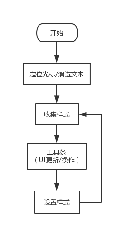
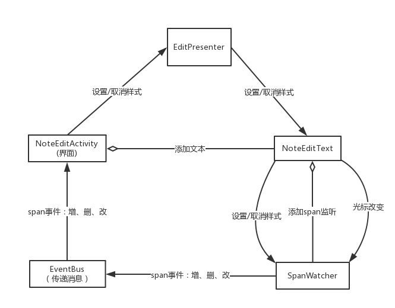

#富文本功能  
## 背景
### 1. EditText默认支持富文本，可以给文本增加各种样式（span），包括下划线、字体颜色、背景色、加粗/斜体、图片等，这些样式通过组合在SpannableStringBuilder里然后设置给EditText  

### 2. SpannableStringBuilder添加/设置样式  
	void setSpan(Object what, int start, int end, int flags)  
	what:样式  
	start:起始位置  
	end：结束位置                 
	flags:SPAN_INCLUSIVE_EXCLUSIVE、SPAN_INCLUSIVE_INCLUSIVE、SPAN_EXCLUSIVE_EXCLUSIVE、SPAN_EXCLUSIVE_INCLUSIVE等，影响文本改变时span的范围调整，通俗的讲就是span的发散方向
### 3. SpannableStringBuilder获取样式  
	T[] getSpans (int queryStart, int queryEnd, Class<T> kind)  
### 4. SpannableStringBuilder删除样式  
	public void removeSpan(Object what)
### 5. 使用到的样式  
* 下划线 [UnderlineSpan](https://developer.android.com/reference/android/text/style/UnderlineSpan.html)   
* 加粗/斜体 [StyleSpan](https://developer.android.com/reference/android/text/style/StyleSpan.html)      
* 绝对字体大小 [AbsoluteSizeSpan](https://developer.android.com/reference/android/text/style/AbsoluteSizeSpan.html)    
* 对齐 [AlignmentSpan](https://developer.android.com/reference/android/text/style/AlignmentSpan.Standard.html) 
### 6. 光标定位/滑选文本，也是一种样式，即SELECTION\_START、SELECTION\_END。样式全局唯一，flags为Spanned.SPAN\_POINT_POINT  
### 7. SpannableStringBuilder可以通过增加SpanWatcher来监听SpanAdded、SpanRemoved、SpanChanged事件，而SpanWatcher本身又是一种特殊span，为其设置flags为SPAN_INCLUSIVE_INCLUSIVE即向两端发散，这样就可以保证监听整个文本（start：0 end：length）的span变化。 　　　　 
## 设计 
### 1. 光标定位文本时，根据该位置收集到的样式更新工具条。点击工具条上的样式，在光标处增加样式。  
<!--  -->

### 2. 在NoteEditText设置文本时，添加SpanWatcher来监听span事件，其中也包括了光标定位/滑选文本。然后通过EventBus通知界面更新。关键代码片段如下（@NoteEditText.java）：
	@Override
	public void setText(CharSequence text, BufferType type) {
		super.setText(text, type);
		text = getText();
		if(text instanceof Editable || text instanceof Spannable){
		Spannable sp = getText();
		sp.setSpan(new SpanWatcher() {
			@Override
			public void onSpanAdded(Spannable text, Object what, int start, int end) {
				EventBus.getDefault().post(new SpanChangeEvent(NoteEditText.this, what, -1, start, -1, end));
			}
	
			@Override
			public void onSpanRemoved(Spannable text, Object what, int start, int end) {
				EventBus.getDefault().post(new SpanChangeEvent(NoteEditText.this, what, start, -1, end, -1));
			}
	
			@Override
			public void onSpanChanged(Spannable text, Object what, int ostart, int oend, int nstart, int nend) {
				EventBus.getDefault().post(new SpanChangeEvent(NoteEditText.this, what, ostart, nstart, oend, nend));
			}
		}, 0, text.length(), Spanned.SPAN_INCLUSIVE_INCLUSIVE);
	}  
### 3. 添加样式
#### 3.1 滑选文本：在起始到结束位置上添加相应span即可（flags：SPAN\_EXCLUSIVE\_INCLUSIVE）  
#### 3.2 光标位置：起始位置等于结束位置，这种情况下不允许设置flags：SPAN\_EXCLUSIVE\_INCLUSIVE。但我们可以设置flags：SPAN\_INCLUSIVE\_INCLUSIVE,同时增加SPAN\_INTERMEDIATE标记为临时的,待后续span范围大于0时再调整为flags：SPAN\_EXCLUSIVE\_INCLUSIVE  
	int selectStart = textView.getSelectionStart();
	int selectEnd = textView.getSelectionEnd();
	Spannable spannable = (Spannable) textView.getText();
	spannable.setSpan(new UnderlineSpan(), selectStart, selectEnd, selectStart  ==  selectEnd ？Spanned.SPAN_INCLUSIVE_INCLUSIVE | Spanned.SPAN_INTERMEDIATE ： Spanned.SPAN_EXCLUSIVE_INCLUSIVE);
### 4. 取消样式  
### 4.1 滑选文本：移除起始到结束位置上的相应span，并不破坏起始位置前及结束位置后的span
### 4.2 光标位置：改变光标处前后span，针对前面的span临时设置flags：Spanned.SPAN\_EXCLUSIVE\_EXCLUSIVE | Spanned.SPAN\_INTERMEDIAT，后续再调整为flags：SPAN\_EXCLUSIVE\_INCLUSIVE  
	int selectStart = textView.getSelectionStart();
	int selectEnd = textView.getSelectionEnd();
	Spannable spannable = (Spannable) textView.getText();
	int spanStart = spannable.getSpanStart(span);
	int spanEnd = spannable.getSpanEnd(span);
	int spanFlag = spannable.getSpanFlags(span);
	if(spanStart == spanEnd){
		spannable.removeSpan(span);
	}else  if(spanStart < selectStart){
		spannable.setSpan(span, spanStart, selectStart, Spanned.SPAN_EXCLUSIVE_EXCLUSIVE | Spanned.SPAN_INTERMEDIATE);
		if(spanEnd > selectEnd){
		    spannable.setSpan(new UnderlineSpan(), selectEnd, spanEnd, Spanned.SPAN_EXCLUSIVE_INCLUSIVE);
		}
	}else{
		if(spanEnd > selectEnd){
		    spannable.setSpan(span, selectEnd, spanEnd, spannable.getSpanFlags(span));
		}else {
		    spannable.removeSpan(span);
		}
	}  
### 5.对齐样式，属于ParagraphStyle，是针对段落的。所以我们是不能随意设置其起始和结束位置，而文本中段落的标志是回车'\n'。在文本修改中，段落位置会发生变化，这时候我们需要相应修正对样式的起始和结束位置。  
	int start = textView.getSelectionStart();
	int end = textView.getSelectionEnd();
	Spannable sp = (Spannable) textView.getText();
	String str = sp.toString();
	int paraStart = str.lastIndexOf('\n', start - 1);
	if(paraStart < 0){
	    paraStart = 0;
	}else {
	    paraStart++;
	}
	int paraEnd = str.indexOf('\n', end);
	if(paraEnd < 0){
	    paraEnd = sp.length();
	}else {
	    paraEnd++;
	}