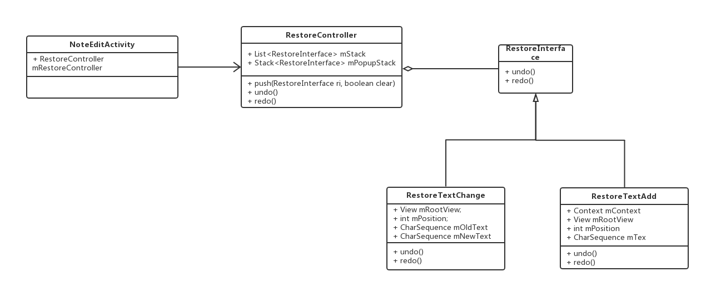
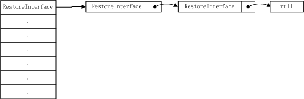
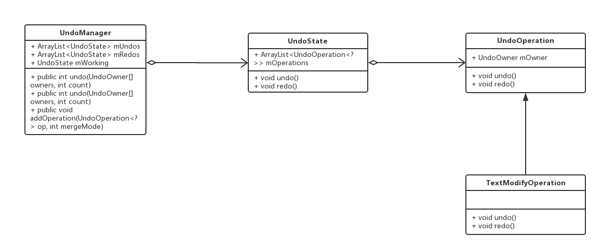

# 撤销还原
## 1.设计模式：命令模式  

## 2.撤销还原命令清单
* RestoreTextChange 文本变化
* RestoreTextAdd 新增文本项
* RestoreTextRemove 删除文本项
* RestoreStageChange 清单状态改变
* RestoreTextSwap 清单拖拽
* RestoreTextSpan 富文本
* RestoreTextMerge 文本合并，例如删除录音或图片时，前后文本可能会发生合并（待废除）
* RestoreImage 图片增删
* RestoreRecord 录音增删
## 3.通过TextWatcher监听文本变化，在beforeTextChanged时计算oldText，在onTextChanged时计算newText。同时我们需要规避输入过程中产生的额外文本变化，例如中文输入过程中带下划线的拼音
	//撤消、还原监听
    class RestoreTextWatcher implements TextWatcher{
        private View mView;
        private int mPosition;
        private int mStart;
        private RestoreTextChange mRestoreTextChange;
        // 输入法一般会执行多次composingText后再执行commitText，添加变量isComposing标记当前是否正在composing text
        // https://developer.android.com/guide/topics/text/creating-input-method.html#SendText
        private boolean isComposing = false;
        RestoreTextWatcher(View view){
            mView = view;
            //mPosition = position;
        }

        @Override
        public void afterTextChanged(Editable s) {
            // TODO Auto-generated method stub
        }

        @Override
        public void beforeTextChanged(CharSequence s, int start, int count,
                                      int after) {
            // TODO Auto-generated method stub
            if(!mUndoRedo){
                mPosition = getChildPosition((View)mView.getParent());
                if(mPosition < 0){
                    return;
                }
                if (isComposing) {
                    return;
                }
                mStart = start;
                mRestoreTextChange = new RestoreTextChange(mEditParent , mPosition, mStart);
                mRestoreTextChange.setOldText(s.subSequence(start, start + count));
            }
        }

        @Override
        public void onTextChanged(CharSequence s, int start, int before,
                                  int count) {
            // TODO Auto-generated method stub
            if(!mUndoRedo){
                int position = getChildPosition((View)mView.getParent());
                //mPosition = getChildPosition((View)mView.getParent());
                if(position < 0){
                    return;
                }
                if (SpanUtil.hasComposingFlag(s)) {
                    isComposing = true;
                } else {
                    isComposing = false;
                    if(mRestoreTextChange != null && mStart == start){
                        // 在composing text过程中position可能改变
                        mRestoreTextChange.setmPosition(position);
                        CharSequence change = s.subSequence(start, start + count);
                        mRestoreTextChange.setNewText(change);
                        if(!mRestoreTextChange.equals()){
                            mRestoreController.pushBack(mRestoreTextChange, true);
                        }
                        mRestoreTextChange = null;
                    }
                }
            }
        }

    }
## 4.用户的一个操作，背后可能会产生多个修改，例如在文本中插入图片时会涉及当前文本变化（RestoreTextChange）、新增图片（RestoreImage）、新增文本（RestoreTextAdd），站在用户体验的角度，还原时需要将多个变化一步完成。因此我们引入了批操作的概念，通过链表来存储批操作。
### 4.1 数据结构

### 4.2 撤销时逆序遍历链表，还原时顺序遍历链表
	private void undoRecursive(RestoreInterface ri) {
		if (ri == null) return;
		if (ri.next != null) {
			undoRecursive(ri.next);
		}
		ri.undo();
	}

	private void redoRecursive(RestoreInterface ri) {
		if (ri == null) return;
		ri.redo();
		if (ri.next != null) {
			redoRecursive(ri.next);
		}
	}
## 5.EditText原生自带撤销还原，入口同复制粘贴，但公共已经屏蔽了。局限于控件内部的撤销还原，并不满足我们全局撤销还原的产品需求，所以我们自己设计了上面这套撤销还原的方案。关于EditText原生的撤销还原功能，我们可以学习借鉴。
### 5.1 EditText撤销还原设计类图

### 5.2 EditText通过InputFilter来监听文本变化（@Editor.java）
	public static class UndoInputFilter implements InputFilter {
        final Editor mEditor;

        public UndoInputFilter(Editor editor) {
            mEditor = editor;
        }

        @Override
        public CharSequence filter(CharSequence source, int start, int end,
                Spanned dest, int dstart, int dend) {
            if (DEBUG_UNDO) {
                Log.d(TAG, "filter: source=" + source + " (" + start + "-" + end + ")");
                Log.d(TAG, "filter: dest=" + dest + " (" + dstart + "-" + dend + ")");
            }
            final UndoManager um = mEditor.mUndoManager;
            if (um.isInUndo()) {
                if (DEBUG_UNDO) Log.d(TAG, "*** skipping, currently performing undo/redo");
                return null;
            }

            um.beginUpdate("Edit text");
            TextModifyOperation op = um.getLastOperation(
                    TextModifyOperation.class, mEditor.mUndoOwner, UndoManager.MERGE_MODE_UNIQUE);
            if (op != null) {
                if (DEBUG_UNDO) Log.d(TAG, "Last op: range=(" + op.mRangeStart + "-" + op.mRangeEnd
                        + "), oldText=" + op.mOldText);
                // See if we can continue modifying this operation.
                if (op.mOldText == null) {
                    // The current operation is an add...  are we adding more?  We are adding
                    // more if we are either appending new text to the end of the last edit or
                    // completely replacing some or all of the last edit.
                    if (start < end && ((dstart >= op.mRangeStart && dend <= op.mRangeEnd)
                            || (dstart == op.mRangeEnd && dend == op.mRangeEnd))) {
                        op.mRangeEnd = dstart + (end-start);
                        um.endUpdate();
                        if (DEBUG_UNDO) Log.d(TAG, "*** merging with last op, mRangeEnd="
                                + op.mRangeEnd);
                        return null;
                    }
                } else {
                    // The current operation is a delete...  can we delete more?
                    if (start == end && dend == op.mRangeStart-1) {
                        SpannableStringBuilder str;
                        if (op.mOldText instanceof SpannableString) {
                            str = (SpannableStringBuilder)op.mOldText;
                        } else {
                            str = new SpannableStringBuilder(op.mOldText);
                        }
                        str.insert(0, dest, dstart, dend);
                        op.mRangeStart = dstart;
                        op.mOldText = str;
                        um.endUpdate();
                        if (DEBUG_UNDO) Log.d(TAG, "*** merging with last op, range=("
                                + op.mRangeStart + "-" + op.mRangeEnd
                                + "), oldText=" + op.mOldText);
                        return null;
                    }
                }

                // Couldn't add to the current undo operation, need to start a new
                // undo state for a new undo operation.
                um.commitState(null);
                um.setUndoLabel("Edit text");
            }

            // Create a new undo state reflecting the operation being performed.
            op = new TextModifyOperation(mEditor.mUndoOwner);
            op.mRangeStart = dstart;
            if (start < end) {
                op.mRangeEnd = dstart + (end-start);
            } else {
                op.mRangeEnd = dstart;
            }
            if (dstart < dend) {
                op.mOldText = dest.subSequence(dstart, dend);
            }
            if (DEBUG_UNDO) Log.d(TAG, "*** adding new op, range=(" + op.mRangeStart
                    + "-" + op.mRangeEnd + "), oldText=" + op.mOldText);
            um.addOperation(op, UndoManager.MERGE_MODE_NONE);
            um.endUpdate();
            return null;
        }
    } 